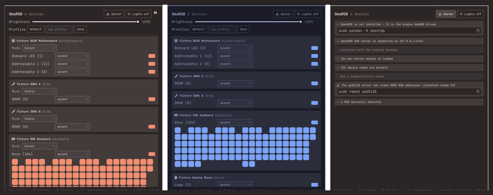

# OmaRGB

**Every RGB device, wearing your theme.**

Omarchy themes your terminal, your editor, your shell — and with Accord, your
apps. OmaRGB does the last mile: the hardware on your desk. Keyboards, mice,
coolers, RAM, motherboards and cases follow your theme's palette live, react
to your desktop, and when Arch RGB is being Arch RGB, a built-in Doctor tells
you exactly what to fix.



*One rig, two themes, zero clicks in between — and the Doctor for when nothing
lights up.*

## What it does

- **Follows your theme, fully.** The moment you `omarchy-theme-set`, every
  managed device repaints from the *resolved theme palette* — not just one
  accent color. Each device and each zone can wear a semantic role: `accent`,
  `foreground`, `background`, `muted`, `urgent`, or any named theme color
  (`red` … `magenta`). Light themes just work; nothing is hardcoded.
- **A real control room.** Device cards with zones, hardware modes, a full
  saturation/value color picker (pastels and white included), software
  brightness that works on brightness-less controllers, OpenRGB profiles,
  and a live **keyboard matrix** rendered from the device's actual layout.
- **Reacts to your desktop.** Lock your session and the lights dim or go
  dark — they restore to exactly what they showed, on unlock. A window
  demands attention? The rig flashes your theme's urgent color. Both are
  settings on the bar widget (Dim / Lights off / Nothing, flash on or off) —
  and lights-off-when-away means your rig stops lighting the room at night.
- **The Doctor.** Linux RGB has famous failure modes: missing udev rules,
  `i2c-dev` not loaded, Gigabyte's ACPI/SMBus conflict, the DDR5 `spd5118`
  driver squatting on RGB addresses. The Doctor checks all of it and hands
  you copyable fixes. If OpenRGB isn't installed at all, OmaRGB says so
  instead of looking broken.
- **One engine, every vendor.** OpenRGB supports hundreds of devices across
  ASUS, Corsair, Razer, Logitech, G.Skill, NZXT, MSI and more. OmaRGB speaks
  its SDK protocol directly — one plugin instead of one widget per brand.

## Install

```
omarchy plugin add https://github.com/vonsensey/omargb --enable
```

Then install the engine, if you haven't already:

```
sudo pacman -S openrgb
```

That's the whole setup. No pip packages, no venv, no daemons to configure —
OmaRGB starts OpenRGB's SDK server itself when none is running. (To have the
server persist across reboots without OmaRGB: `openrgb --autostart-enable
"--startminimized --server"`.)

A keybinding, if you want one, in `~/.config/hypr/bindings.conf`:

```
bindd = SUPER SHIFT, R, RGB control, exec, omarchy-shell shell toggle io.github.vonsensey.omargb
```

## Remove

```
omarchy plugin remove io.github.vonsensey.omargb
rm -rf ~/.local/state/omargb        # its state file, if you want it gone too
```

Your devices keep whatever colors they last showed (or whatever their
firmware boots with). Note: removing just the bar widget from the bar
disables the whole plugin — that is how Omarchy anchors bar-widget plugins.

## How the theme mapping works

Every zone resolves its color by precedence:

1. **Manual override** — a color you picked in the panel (per zone)
2. **Zone role** — e.g. this keyboard's `Keys` zone wears `urgent`
3. **Device role** — e.g. the whole cooler wears `accent` (the default)

Roles resolve against `omarchy-theme-color --all`, the same resolver Omarchy
uses for its own templates, so missing keys are synthesized exactly the way
the rest of your system sees them. Omarchy already ships a one-color
theme-to-keyboard bridge for ASUS ROG and Framework 16 (`keyboard.rgb`);
OmaRGB is the whole-rig, whole-palette version of the same idea. If you have
one of those devices, both will write to it on theme change — last writer
wins, and OmaRGB runs later, so its zone roles win.

## No RGB hardware handy?

The repo ships the test rig as a runnable fake:

```
python3 test/mock_server.py    # a six-device OpenRGB server on 127.0.0.1:6742
```

Six plausible devices — motherboard, two DIMMs, a 104-key keyboard with a
real matrix map, mouse, AIO cooler — that the plugin drives exactly like
real hardware. It is how most of this plugin was built and tested.

## What it writes, and what it does not

Writes:

- `~/.local/state/omargb/state.json` — roles, overrides, power, brightness,
  and the last applied palette (so state survives restarts)

Does not:

- No files outside `~/.local/state/omargb/`
- No pip installs, no venvs, no systemd units, no udev edits (the Doctor
  *suggests* commands; it never runs them — you do, with sudo, if you agree)
- No network beyond **one TCP connection to 127.0.0.1:6742**, the local
  OpenRGB SDK server. Nothing leaves your machine, ever. The only process
  it starts is `openrgb --server --server-host 127.0.0.1` (loopback-only),
  and only when no server is running.

The bridge is a single pure-python3-stdlib file (`bin/omargb-bridge`) that
implements the OpenRGB SDK wire protocol (versions 0–5) itself. You can read
every byte it can ever send.

## Footprint

The bridge idles at ~20 MB RSS. No polling loops: theme changes arrive as
shell signals, device changes as SDK push events, and lock/urgent reactions
as in-process bindings.

## Tested how

- 48 Python tests: the wire protocol (byte-exact golden vectors, protocol
  0/3/5 servers), palette mapping precedence, overlay restore semantics, and
  the Doctor against fabricated machines — all against a mock SDK server
  whose serializer is written independently of the bridge's parser.
- QML logic probed headlessly; UI exercised live on Omarchy 4.0 against the
  mock rig (screenshots above are real captures).
- The wire protocol is implemented from OpenRGB 1.0rc3's own headers and SDK
  documentation (protocol 5 — what Arch ships today), with graceful
  negotiation down to protocol 0 for old servers. If a device of yours
  misbehaves, open an issue with `openrgb --loglevel 6` output — the device
  layer is OpenRGB's own, so quirks usually reproduce in its GUI too.

## License

MIT
