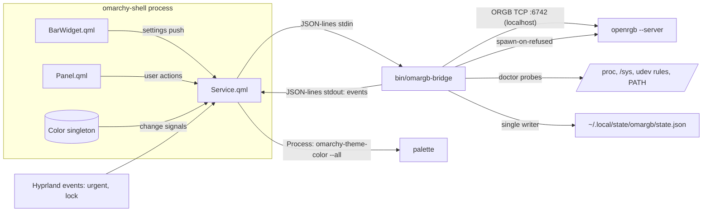

# OmaRGB Plugin - Plan

**Target repo:** `~/Projects/omarchy/competition/omargb` (this repo, new). Plugin id `io.github.vonsensey.omargb`, kinds `service` + `bar-widget` + `panel`.

---

## Goal Capsule

Build and ship **OmaRGB**, entry #4 for the Omarchy plugin competition: the RGB control center for Omarchy. One plugin that controls every OpenRGB-supported device (motherboard, RAM, GPU, cooler, keyboard, mouse), paints hardware with the **full theme palette** live on theme change, reacts to desktop state (lock/idle dim-off, urgent flash), and ships a **Doctor** that diagnoses the notorious Arch RGB setup failures with copyable fixes.

Authority: this plan > recon reports (`scratchpad/recon/*.md`) > general knowledge. Stop conditions: submit-by Sat 2026-08-22; if live hardware acceptance is impossible before submission, ship with mock+server-level verification and honest README claims (never claim untested hardware behavior — see memory `verify-live-before-claiming`). All tests must pass on a machine with zero RGB hardware.

---

## Product Contract

### Summary

The RGB lane on the marketplace is eight vendor silos plus one good OpenRGB wrapper (`didlix.case-rgb`, ★3). Nobody maps more than one accent color to hardware, nobody reacts to desktop events, nobody diagnoses setup failures, and the strongest competitor requires a terminal setup step that builds a venv and pip-installs from PyPI. Omarchy itself ships a v0 of theme→keyboard RGB (`keyboard.rgb` = accent, asusctl/qmk_hid only) — the core team believes in this direction and left it unfinished. OmaRGB completes it.

### Requirements

Theme integration:
- R1. On every theme change, remap all managed devices/zones to the new theme's palette live, with no hook file installation and no user action (in-process Color singleton trigger).
- R2. Role-based mapping: each device and each zone can be assigned a semantic role (`accent`, `background`, `foreground`, `urgent`, `muted`, or any of the 8+8 named theme colors); sensible per-device-type defaults apply out of the box.
- R3. Light/dark aware: mapping uses the resolved palette of the active theme (via `omarchy-theme-color --all`), which differs per theme mode; no hardcoded colors anywhere (Bjarne test).

Control:
- R4. Panel lists every detected device with type, zones, modes; per-zone color override with a full saturation/value color picker (not hue-only — pastels and white reachable).
- R5. Brightness control (software RGB scaling, works on brightness-less controllers) and hardware mode selection per device.
- R6. OpenRGB profile save/load from the panel (SDK packets 150-152).
- R7. Keyboard MATRIX zones render as a visual key-matrix with live per-LED colors.
- R8. Bar widget shows connection/device state in all 4 bar orientations; click opens panel; right-click toggles lights on/off.

Doctor:
- R9. A Doctor view runs local diagnostics — openrgb installed, SDK server reachable, udev rules present, i2c-dev loaded, DMI/board-specific hints (acpi_enforce_resources for Gigabyte, spd5118 for DDR5), device count by type — each check pass/warn/fail with a one-line explanation and a copyable fix command.
- R10. When OpenRGB is missing or the server is unreachable, the plugin degrades to the Doctor view instead of appearing broken (the omarewind lesson: never an empty/invisible surface on fresh install).

Reactive:
- R11. On session lock (and optionally idle/screen-off), dim or turn off all lights; restore exact prior state on unlock.
- R12. On a Hyprland `urgent` window event, flash managed devices in the theme's urgent color, then restore.

Platform citizenship:
- R13. Zero third-party dependencies: bundled pure-python3-stdlib bridge; network use is exactly one TCP connection to 127.0.0.1:6742, disclosed in README.
- R14. Install → works: no terminal setup step; bridge auto-spawns `openrgb --server --server-host 127.0.0.1` when no server is running.
- R15. README: install AND removal instructions, "What it writes, and what it does not" section, measured memory, relationship to built-in `keyboard.rgb`/`omarchy-theme-set-keyboard`.

### Scope Boundaries

Deferred to follow-up work: per-key painting UI (matrix is visualized, painted per-zone in v1); OpenRGB Effects Plugin control (pkt 201 sub-protocol); driving other lighting plugins' IPC (WLED/Hue orchestration); audio-reactive/ambient screen-sampling modes; workspace-color mapping.
Outside identity: replacing OpenRGB's own GUI for device-quirk configuration; smart-home lighting (Hue/WLED have dedicated plugins).

### Success Criteria

`omarchy plugin validate` passes; full test suite green on this laptop (zero RGB hardware); against a real `openrgb --server` with 0 devices: connects, negotiates v5, reports empty rig, Doctor explains why; theme switch remaps mock rig palettes ≤1s; marketplace submission validated at the pinned SHA.

---

## Planning Contract

### Key Technical Decisions

- KTD1 **Bundled pure-stdlib bridge over openrgb-python/CLI.** `bin/omargb-bridge` (python3 stdlib only) owns one persistent TCP socket to 127.0.0.1:6742, implements ORGB protocol ≤v5 itself, and speaks JSON-lines over stdio to the QML service. Rationale: Quickshell 0.3 cannot do TCP or binary (Socket is unix+QString-only); case-rgb's venv+PyPI setup step is its biggest weakness; omajam is the listed precedent for exactly this pattern. Persistent connection gives push events (`DEVICE_LIST_UPDATED`) instead of polling.
- KTD2 **In-process theme trigger, no hook.** Service binds to `Color.accent`/`foreground`/`background`/`urgent`/`muted` (import `qs.Commons`); on change it runs `omarchy-theme-color --all` (the official resolver — synthesizes missing `orange`/`brown`, adds `color0-15` + `theme_type`) and pushes the palette to the bridge. Rationale: works with zero installation, fires even when hooks are skipped, and file-watching `colors.toml` is fragile (theme dir is atomically replaced). Note: `omarchy-theme-set-keyboard` (built-in, asusctl/qmk_hid) runs before we see the change; on ASUS hardware both write — we supersede, documented in README.
- KTD3 **Single writer, bridge-owned state.** The bridge is the only process that talks to OpenRGB and the only writer of `~/.local/state/omargb/state.json` (roles, overrides, on/off, last-applied snapshot — for restore after bridge/server restart). QML holds a mirror fed by events, never reads the file.
- KTD4 **Server on demand, no systemd writes.** On ECONNREFUSED the bridge spawns `openrgb --server --server-host 127.0.0.1` (detached) once, then retries with backoff. No unit files are written (smaller "what it writes" footprint than case-rgb). README documents `openrgb --autostart-enable "--startminimized --server"` and the Arch system unit as persistence options.
- KTD5 **Protocol v5 ceiling, graceful floor.** Negotiate `min(server, 5)`; parse controller data version-aware (vendor v1+, mode brightness v3+, zone segments v4+, zone/controller flags v5+); REQUEST_PROTOCOL_VERSION timeout ⇒ v0 (pre-0.5 servers). Arch ships 1.0rc3 = v5.
- KTD6 **Apply semantics that spare device flash.** Role/palette applies use SetCustomMode(1100) + UpdateZoneLEDs(1051) (Direct); SaveMode(1102) fires only on an explicit "persist to device" action. Zone-differing colors force the Direct path (ASUS Aura ignores zone writes in Static — case-rgb's hardware finding, adopted).
- KTD7 **Reactive = overlays over a snapshot.** Lock-dim and urgent-flash are temporary overlays; the bridge snapshots last-applied state and restores it exactly. Restore correctness is bridge-side and mock-tested.

### Assumptions (auto-mode inferred bets)

- Name/id `OmaRGB` / `io.github.vonsensey.omargb` (user's own suggestion; collision-checked against 757 listed + 145 in-flight).
- Lock detection mechanism is an execution-time discovery (candidates: Quickshell.Hyprland rawEvent, `loginctl` LockedHint, shell lock plugin state) — verifiable live on this machine; the plan does not pretend it is settled (see Open Questions).
- Live hardware acceptance happens on the user's rig before submission; if unavailable, README claims are scoped to what the mock + zero-device server proved.

### High-Level Technical Design

Bridge command/event contract (directional): commands in `{"cmd": "...", ...}` — `snapshot`, `set-zone-color`, `set-role`, `set-palette`, `brightness`, `power`, `mode`, `profile-save/load/list`, `persist`, `overlay-dim`, `overlay-flash`, `overlay-clear`, `doctor`, `rescan`; events out `{"event": "...", ...}` — `rig` (full device tree), `applied`, `connected`, `disconnected` (with `retryIn`), `doctor-report`, `error`.

### Patterns to follow

- omajam bridge wiring: `Process { command: ["python3", path]; stdinEnabled: true; stdout: SplitParser { splitMarker: "\n" } }`, path from `manifest.__sourceDir`, 2s restart timer (clone at `scratchpad/omajam`).
- Sibling repos `../accord`, `../omavet`: flat QML at root, `bin/` executables with `/usr/bin/python3`-safe invocation, `test/check.sh` single runner, `test/fixtures/`, README structure, MIT LICENSE.
- Memory `omarchy-plugin-api`: barWidget schema is the settings contract (values arrive as strings — `Number()` coercion); services receive no settings (widget pushes, guard transient empty push); `Text.PlainText` for device/zone names (server-provided = untrusted); no `Qt.darker` on black (opacity); 4 bar orientations; `.pragma library` JS for qml6-testable logic (`QT_FORCE_STDERR_LOGGING=1 QT_QPA_PLATFORM=offscreen`).

---

## Implementation Units

### U1. Repo scaffold and manifest

**Goal:** Valid installable plugin skeleton. **Requirements:** R8, R13. **Dependencies:** none.
**Files:** `manifest.json`, `LICENSE`, `.gitignore`, `test/check.sh`, stub `Service.qml`, `BarWidget.qml`, `Panel.qml`.
**Approach:** id `io.github.vonsensey.omargb`, kinds `["service","bar-widget","panel"]`, entryPoints for all three; `barWidget` block with schema: `followTheme` (bool, default true), `reactiveLock` (bool), `reactiveUrgent` (bool), `brightness` (0-100), `updateHz` (default 20). Document in README later that removing the bar widget disables the whole plugin (enablement anchor).
**Test scenarios:** `omarchy plugin validate` passes; check.sh runs and exits 0 with no tests yet.
**Verification:** validate output clean; deployed copy loads in shell without errors.

### U2. Mock ORGB server (test harness)

**Goal:** Protocol-v5 mock server the entire suite runs against. **Requirements:** R13 (testability). **Dependencies:** U1.
**Files:** `test/mock_server.py`, `test/fixtures/rig.py` (device definitions).
**Approach:** stdlib socketserver on an ephemeral localhost port. Fixture rig: motherboard (SINGLE + 2 LINEAR zones), 2× DRAM, keyboard with MATRIX zone (6×21 map incl. 0xFFFFFFFF gaps), mouse (2 zones), cooler. Serves count/controller-data (version-aware serialization), accepts SetCustomMode/UpdateLEDs/UpdateZoneLEDs/UpdateSingleLED/UpdateMode/SaveMode/profiles, records every received packet for assertions. Fault injection: refuse next N connections, silent version reply (v0 fallback path), push DEVICE_LIST_UPDATED, stall.
**Test scenarios:** mock self-test — serialize/reparse round-trip of the rig at protocol 5 and 3; recorded-packet log ordering.
**Verification:** `test/check.sh` green.

### U3. Bridge protocol core

**Goal:** `bin/omargb-bridge` connects, enumerates, and controls devices. **Requirements:** R4, R5, R6, R13, R14. **Dependencies:** U2.
**Files:** `bin/omargb-bridge`, `test/test_bridge.py`.
**Approach:** ORGB framing per recon (16B header, little-endian; RGBColor `(b<<16)|(g<<8)|r`); version negotiation with v0 timeout fallback; version-aware controller-data parser incl. matrix maps; JSON-lines stdio loop (threaded reader, main loop select on socket + stdin); auto-spawn server per KTD4; reconnect with backoff + `disconnected`/`retryIn` events; DEVICE_LIST_UPDATED ⇒ re-enumerate ⇒ `rig` event. `--host/--port` flags for tests.
**Execution note:** test-first against the mock; every packet-building/parsing function unit-tested with byte-exact fixtures.
**Test scenarios:** happy: enumerate rig (names/types/zones/matrix parsed exactly); set zone color ⇒ mock receives SetCustomMode then UpdateZoneLEDs with correct bytes; brightness scaling math (0/50/100%, rounding, black stays black); profile list/load/save byte layout. Edge: v3 server (no zone flags) parses; v0 fallback after version timeout; empty rig (0 devices) yields `rig` with empty list not error; oversized name strings; connection refused ⇒ spawn attempted once ⇒ retry/backoff events; server dies mid-session ⇒ `disconnected` then auto-reconnect ⇒ state re-applied from snapshot. Error: malformed packet header ⇒ resync or clean error event, never crash.
**Verification:** all bridge tests green hardware-free.

### U4. Doctor

**Goal:** Diagnostics with copyable fixes. **Requirements:** R9, R10. **Dependencies:** U3 (shares bridge process, `doctor` command).
**Files:** doctor section in `bin/omargb-bridge`, `test/test_doctor.py`, `test/fixtures/sysroot-*` (fake /proc, /sys, udev trees).
**Approach:** checks (each `{id, status, summary, fix}`): openrgb on PATH; TCP 6742 reachable; `60-openrgb.rules` under /usr/lib/udev/rules.d or /etc/udev/rules.d; `i2c-dev` in /proc/modules; /dev/i2c-* present; board vendor Gigabyte/Aorus + `acpi_enforce_resources` absent from /proc/cmdline ⇒ warn with kernel-param fix; `spd5118` loaded ⇒ warn (DDR5 UU) with `rmmod` fix; device count by type from live rig (0 devices + all-ok prerequisites ⇒ warn pointing at i2c/udev deep-dive wiki). All probes take a root-path parameter so fixtures can fake any machine.
**Test scenarios:** golden machine ⇒ all ok; missing openrgb ⇒ fail with `sudo pacman -S openrgb` fix; i2c-dev absent ⇒ fail with modprobe + modules-load fix; Gigabyte board without param ⇒ warn; non-Gigabyte ⇒ that check skipped; spd5118 loaded ⇒ warn; port closed but binary present ⇒ specific "server not running" status distinct from "not installed".
**Verification:** doctor tests green; manual run on this laptop reports the true state (openrgb missing ⇒ fail row).

### U5. Theme mapper

**Goal:** Palette→roles→zone colors, live. **Requirements:** R1, R2, R3. **Dependencies:** U3.
**Files:** mapping logic in `bin/omargb-bridge` (`set-palette` handling + role model), `test/test_mapper.py`.
**Approach:** role vocabulary = 5 foundational + named colors (`red`…`bright_magenta`); defaults by device type (keyboard/mouse/mousemat→`accent`, motherboard/cooler→`accent`, DRAM/LEDSTRIP→`accent` with multi-zone spread option later — defaults stay simple, overrides per device/zone stored in state.json). Bridge receives full resolved palette dict (from `omarchy-theme-color --all` output parsed QML-side or bridge-side — bridge-side: QML just sends raw stdout, bridge parses tab-separated pairs). Apply-diff: only devices whose target colors changed get writes.
**Test scenarios:** default mapping applies accent to keyboard zones via Direct; per-zone override to `urgent` wins over device role; palette missing a named color falls back to accent (defensive, though resolver synthesizes); light-theme palette maps identically (no dark-only assumptions); re-sending identical palette produces zero writes; snapshot updated after apply (restore-source correctness).
**Verification:** mapper tests green; end-to-end: send ristretto then tokyo-night palettes ⇒ mock records two distinct correct color sets.

### U6. QML Service + BarWidget

**Goal:** Shell integration: bridge lifecycle, theme trigger, bar presence. **Requirements:** R1, R8, R10. **Dependencies:** U3, U5.
**Files:** `Service.qml`, `BarWidget.qml`, `lib/format.js` (`.pragma library` — status/ color helpers), `test/qml-probe.sh` additions to check.sh.
**Approach:** Service per omajam pattern; guards: don't start Process with empty sourceDir; restart timer; widget pushes settings to service (guard empty transient push); theme trigger = connections to Color role change signals, debounced (one `omarchy-theme-color --all` run per change burst), gated on `followTheme`. BarWidget: count+swatch pill; states normal/disconnected/needs-setup (distinct glyphs, never invisible — R10); left-click summon panel via shell IPC, right-click power toggle; vertical bar layouts; broadcast() sync across monitors; tooltip with device summary (literal strings only).
**Test scenarios (qml6 probes on lib/format.js):** state-label mapping for each connection state; settings string→number coercion (updateHz "20" ⇒ 20, garbage ⇒ default); swatch color pass-through never applies Qt.darker.
**Verification:** deployed to `~/.config/omarchy/plugins`, shell rescan loads it; widget visible in needs-setup state on this laptop (no openrgb yet); no console errors in journald.

### U7. Panel

**Goal:** The control room. **Requirements:** R4-R7, R9. **Dependencies:** U4, U5, U6.
**Files:** `Panel.qml`, `ui/DeviceCard.qml`, `ui/ColorPicker.qml`, `ui/MatrixView.qml`, `ui/DoctorView.qml`, `lib/colorutil.js`, tests via qml6 probes on `lib/colorutil.js`.
**Approach:** header (power, follow-theme toggle, brightness, profiles row); device list of cards (type icon, zones with role chip + swatch, mode selector); ColorPicker = SV square + hue bar (Canvas gradient, drag + arrow-key nav) emitting hex; MatrixView renders matrix_map grid with live colors (cell size adaptive, gaps for 0xFFFFFFFF); DoctorView list with status glyphs and fix rows (click = copy via Quickshell clipboard); switches to DoctorView automatically when disconnected/not-installed (R10). All text from server through `Text.PlainText`. Esc closes; full keyboard navigation. Theme colors from Color singleton only.
**Test scenarios (colorutil.js):** hsv↔rgb↔hex round-trips incl. black/white/greys; picker coordinate→SV math at boundaries (0,0), (1,1); matrix layout math maps LED index→row/col correctly with gaps.
**Verification:** panel opens via IPC on this laptop showing Doctor (no hardware); screenshots across ristretto + rose-pine + tokyo-night for README.

### U8. Reactive engine

**Goal:** Lock/idle dim-off, urgent flash. **Requirements:** R11, R12. **Dependencies:** U5, U6.
**Files:** reactive handling in `Service.qml` + bridge `overlay-*` commands, `test/test_overlay.py`.
**Approach:** bridge implements overlays per KTD7 (`overlay-dim` factor, `overlay-flash` color+duration with auto-restore, `overlay-clear`). QML side: urgent via Quickshell.Hyprland raw event stream filtered for `urgent`; lock mechanism resolved empirically (Open Question OQ1 candidates) — whichever fires reliably on this machine wins; both gated by settings toggles.
**Execution note:** bridge overlay semantics test-first against mock (that is where restore-correctness lives); the QML trigger is thin glue proven live on this laptop (locking the session is hardware-free).
**Test scenarios:** dim then clear restores exact prior colors; flash auto-restores after duration; overlay atop overlay (urgent during lock-dim) restores to snapshot not to intermediate; disconnect during overlay ⇒ reconnect re-applies base state not the overlay.
**Verification:** live on this laptop: lock session ⇒ bridge log shows overlay-dim against mock rig; unlock restores.

### U9. Docs, preview, acceptance, ship

**Goal:** Submission-grade package. **Requirements:** R15, all. **Dependencies:** U1-U8.
**Files:** `README.md`, `preview.png`, `docs/img/*.png`, final `test/check.sh`.
**Approach:** README per accord/omavet structure: hero, install (one line) AND removal, Doctor section, "What it writes, and what it does not" (state.json, nothing else; network = 127.0.0.1:6742 only, one disclosed spawn of `openrgb --server`), measured RSS of bridge + shell delta, built-in `keyboard.rgb` relationship, honest hardware-testing status. preview.png 3-panel poster (panel + matrix + doctor across two themes) via grim from focused surface (memory: resolve geometry, plugin-disabled baseline not needed here). Ship: repo public, push, `[Plugin]: OmaRGB` issue per SUBMISSION.md recipe, verify validation SHA == origin HEAD.
**Test expectation:** none — packaging/docs; verification is validate + submission pipeline.
**Verification:** marketplace bot validation passes at pinned SHA; issue shows `submission, validated`.

---

## Verification Contract

- `test/check.sh` — single runner: python tests (mock server + bridge + doctor + mapper + overlays) then qml6 offscreen probes (`QT_FORCE_STDERR_LOGGING=1 QT_QPA_PLATFORM=offscreen`). Must be green on a machine with no RGB hardware and no openrgb installed (doctor tests use fixtures; bridge tests use the mock).
- `omarchy plugin validate` clean.
- Live shell checks on this laptop: plugin loads, widget shows needs-setup state, panel opens to Doctor, lock-overlay fires. After `sudo pacman -S openrgb` (user action): bridge connects to real server, negotiates v5, empty-rig path + Doctor "0 devices" guidance.
- Real-hardware acceptance on the user's rig before submission when available; README claims scoped to what was actually proven.

## Definition of Done

Global: all units verified; suite green; validate clean; repo pushed; marketplace issue filed and validated at origin HEAD; README claims each backed by a test or a live check; no dead/experimental code in the final diff; no `ponytail:` labels in public code (reword caveats per memory); memory updated with shipped state.

## Open Questions

- OQ1 (deferred to U8, non-blocking): exact lock/idle signal — Hyprland raw event vs loginctl LockedHint vs shell lock state; decided empirically on this machine.
- OQ2 (deferred, non-blocking): whether `rig` snapshots should throttle matrix per-LED color echoes for very large keyboards (measure first).

## Sources & Research

- Recon reports (protocol bytes, competitor teardowns, theme internals): scratchpad `recon/*.md`; durable digest in memory `omarchy-omargb-entry4`.
- omajam clone (bridge pattern): scratchpad `omajam/`; case-rgb clone (competitor, hardware quirks): scratchpad `case-rgb/`.
- OpenRGB primary sources: `NetworkProtocol.h`, `RGBControllerInterface.h`, `Documentation/OpenRGBSDK.md`, `Documentation/SMBusAccess.md` (headers cached in scratchpad).
- Demand evidence: r/OpenRGB screen-off thread (2026-08-20), Arch forum i2c threads, last30days raw at `~/Documents/Last30Days/openrgb-linux-rgb-control-problems-raw-v3.md`.
